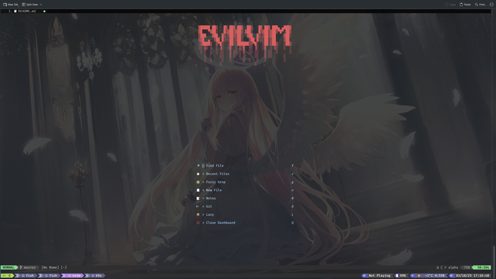
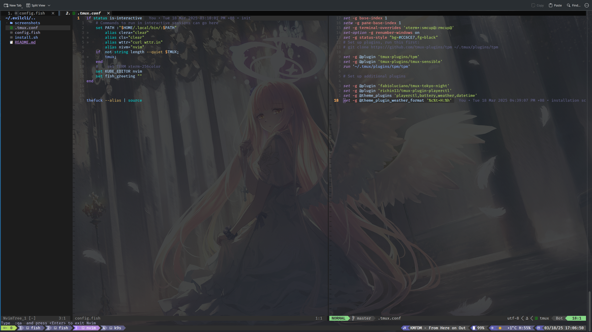

# Evilvim

### Based on kickstart.nvim




## Installation

### Install Neovim

### Install External Dependencies

External Requirements:

- Basic utils: `git`, `make`, `unzip`, C Compiler (`gcc`)
- [ripgrep](https://github.com/BurntSushi/ripgrep#installation)
- Clipboard tool (xclip/xsel/win32yank or other depending on the platform)
- A [Nerd Font](https://www.nerdfonts.com/): optional, provides various icons
  - if you have it set `vim.g.have_nerd_font` in `init.lua` to true
- Emoji fonts (Ubuntu only, and only if you want emoji!) `sudo apt install fonts-noto-color-emoji`
- Language Setup:
  - If you want to write Typescript, you need `npm`
  - If you want to write Golang, you will need `go`
  - etc.

> **NOTE**
> See [Install Recipes](#Install-Recipes) for additional Windows and Linux specific notes
> and quick install snippets

<details><summary> Linux and Mac </summary>

```sh
git clone https://github.com/mikeyloboto/evilvim.git "${XDG_CONFIG_HOME:-$HOME/.config}"/nvim
```

</details>

<details><summary> Windows </summary>

If you're using `cmd.exe`:

```
git clone https://github.com/mikeyloboto/evilvim.git "%localappdata%\nvim"
```

If you're using `powershell.exe`

```
git clone https://github.com/mikeyloboto/evilvim.git "${env:LOCALAPPDATA}\nvim"
```

</details>

### Post Installation

Start Neovim

```sh
nvim
```

That's it! Lazy will install all the plugins you have. Use `:Lazy` to view
the current plugin status. If plugins did not sync, press `S`. Hit `q` to close the window.

#### Read The Friendly Documentation

Read through the `init.lua` file in your configuration folder for more
information about extending and exploring Neovim. That also includes
examples of adding popularly requested plugins.

> [!NOTE]
> For more information about a particular plugin check its repository's documentation.

### Install Recipes

Below you can find OS specific install instructions for Neovim and dependencies.

After installing all the dependencies continue with the [Install Kickstart](#Install-Kickstart) step.

#### Windows Installation

<details><summary>Windows with Microsoft C++ Build Tools and CMake</summary>
Installation may require installing build tools and updating the run command for `telescope-fzf-native`

See `telescope-fzf-native` documentation for [more details](https://github.com/nvim-telescope/telescope-fzf-native.nvim#installation)

This requires:

- Install CMake and the Microsoft C++ Build Tools on Windows

```lua
{'nvim-telescope/telescope-fzf-native.nvim', build = 'cmake -S. -Bbuild -DCMAKE_BUILD_TYPE=Release && cmake --build build --config Release && cmake --install build --prefix build' }
```

</details>
<details><summary>Windows with gcc/make using chocolatey</summary>
Alternatively, one can install gcc and make which don't require changing the config,
the easiest way is to use choco:

1. install [chocolatey](https://chocolatey.org/install)
   either follow the instructions on the page or use winget,
   run in cmd as **admin**:

```
winget install --accept-source-agreements chocolatey.chocolatey
```

2. install all requirements using choco, exit the previous cmd and
   open a new one so that choco path is set, and run in cmd as **admin**:

```
choco install -y neovim git ripgrep wget fd unzip gzip mingw make
```

</details>
<details><summary>WSL (Windows Subsystem for Linux)</summary>

```
wsl --install
wsl
sudo add-apt-repository ppa:neovim-ppa/unstable -y
sudo apt update
sudo apt install make gcc ripgrep unzip git xclip neovim
```

</details>

#### Linux Install

<details><summary>Ubuntu Install Steps</summary>

```
sudo add-apt-repository ppa:neovim-ppa/unstable -y
sudo apt update
sudo apt install make gcc ripgrep unzip git xclip neovim
```

</details>
<details><summary>Debian Install Steps</summary>

```
sudo apt update
sudo apt install make gcc ripgrep unzip git xclip curl

# Now we install nvim
curl -LO https://github.com/neovim/neovim/releases/latest/download/nvim-linux-x86_64.tar.gz
sudo rm -rf /opt/nvim-linux-x86_64
sudo mkdir -p /opt/nvim-linux-x86_64
sudo chmod a+rX /opt/nvim-linux-x86_64
sudo tar -C /opt -xzf nvim-linux-x86_64.tar.gz

# make it available in /usr/local/bin, distro installs to /usr/bin
sudo ln -sf /opt/nvim-linux-x86_64/bin/nvim /usr/local/bin/
```

</details>
<details><summary>Fedora Install Steps</summary>

```
sudo dnf install -y gcc make git ripgrep fd-find unzip neovim
```

</details>

<details><summary>Arch Install Steps</summary>

```
sudo pacman -S --noconfirm --needed gcc make git ripgrep fd unzip neovim
```

</details>

## Other information

Subscribe to [ThePrimeagen](https://www.youtube.com/channel/UC8ENHE5xdFSwx71u3fDH5Xw)

For nice tmux bar (like you see on screenshots), see [evilcli](https://github.com/mikeyloboto/evilcli).
